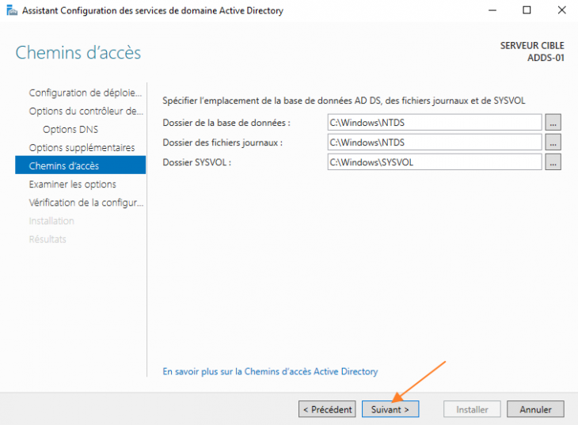
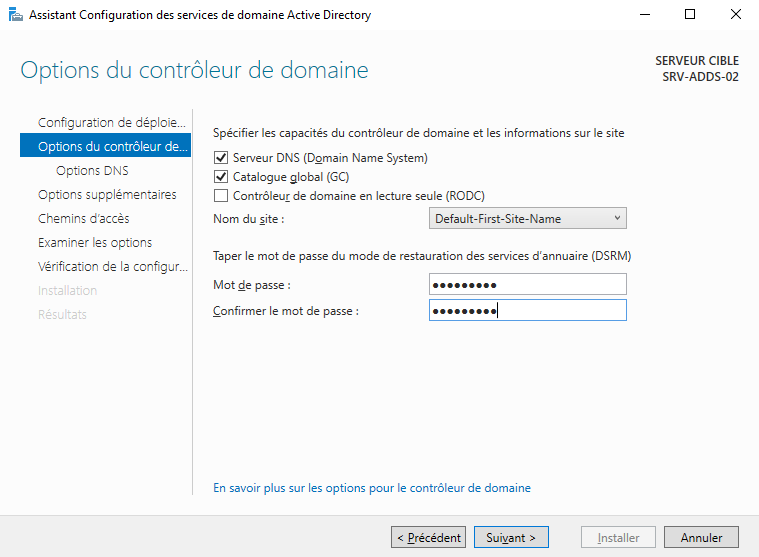

# 
 Documentation technique

## Sommaire

- [ Documentation technique](#-documentation-technique)
  - [Sommaire](#sommaire)
  - [Schéma du réseau](#schéma-du-réseau)
  - [Configuration de PFSENSE](#configuration-de-pfsense)
    - [Créer une VM VirtualBox pour installer PfSense](#créer-une-vm-virtualbox-pour-installer-pfsense)
    - [Installation de PFSense](#installation-de-pfsense)
    - [Configuration des interfaces](#configuration-des-interfaces)
  - [Configuration du premier serveur AD](#configuration-du-premier-serveur-ad)
    - [Installation du serveur AD](#installation-du-serveur-ad)
    - [Promotion en tant que contrôleur de domaine](#promotion-en-tant-que-contrôleur-de-domaine)
  - [Configuration du serveur AD redondant](#configuration-du-serveur-ad-redondant)
  - [Configuration du serveur DHCP](#configuration-du-serveur-dhcp)
    - [Installation du serveur DHCP](#installation-du-serveur-dhcp)
    - [Mise en place d'une nouvelle étendue](#mise-en-place-dune-nouvelle-étendue)
  - [Mise en place du DHCP Relay sur le routeur PFSENSE](#mise-en-place-du-dhcp-relay-sur-le-routeur-pfsense)

## Schéma du réseau

## Configuration de PFSENSE

### Créer une VM VirtualBox pour installer PfSense

Commençons par la création de la machine virtuelle qui va nous permettre d'accueil Pfsense. Ouvrez VirtualBox et cliquez sur le bouton "Nouvelle" pour lancer l'assistant.  

Donnez un nom à cette VM, par exemple "Firewall PfSense" et choisissez le type de système "BSD" puis "FreeBSD (64-bit)" puisque PfSense est basé sur le système FreeBSD.  

Choisissez la quantité de RAM. Disons que 1 Go ce sera suffisant pour faire tourner quelques services et héberger plusieurs VMs sur le réseau local virtuel. Vous pouvez ajuster dans le temps selon vos besoins et même partir sur 512 Mo dans un premier temps.

Créez un nouveau disque virtuel, au format VDI (ou un autre format selon vos préférences), alloué dynamiquement et de taille 16 Go à minima.  

Poursuivez jusqu'à la fin.... Voilà, la machine virtuelle Pfsense est créée et enregistrée dans VirtualBox. Néanmoins, il faut que l'on ajuste la configuration... Sélectionnez la machine virtuelle dans l'inventaire et cliquez sur "Configuration".

Accédez à la section "Réseau", car nous devons configurer deux cartes réseau virtuelles sur notre pare-feu.

Commençons par "Adapter 1" que nous allons configurer en "Accès par pont" et qui correspondra à l'interface WAN de mon pare-feu, c'est-à-dire l'interface côté WAN (permettant d'atteindre Internet). Dans mon cas, le pont est monté sur la carte Wi-Fi "MediaTek Wi-Fi 6....", car elle est actuellement connectée à mon réseau local.

Ensuite, basculez sur l'onglet "Adapter 2" pour configurer la seconde interface réseau virtuelle correspondante à l'interface LAN. Choisissez le mode d'accès "Réseau interne" afin de créer un réseau local virtuel isolé, et nommez ce réseau interne "LAN_VM" (ou autrement).

C'est bon pour la partie réseau, mais nous devons encore faire une dernière chose : charger l'image ISO de PfSense. Cliquez sur "Stockage" puis sur le lecteur, et à droite utilisez le bouton en forme de CD pour ajouter cette image ISO (comme expliqué dans le tutoriel d'introduction à VirtualBox). Voici le résultat :

Il ne reste plus qu'à cliquer sur "OK", car cette fois-ci, la VM est prête !

### Installation de PFSense

Commençons tout de suite par installer pfsense. Après avoir insérer l’ISO de pfsense dans VM 
dédiée, vous pouvez démarrer la machine. Le setup va démarrer automatiquement après quelques 
secondes .

  

L’installation va s’effectuer au clavier. Appuyez sur la touche Entrée pour Accepter.

Vérifiez que vous êtes bien sur « Install » (doit être sélectionné en bleu foncé comme dans l’image ci-dessous, sinon déplacez vous avec les flèches de votre clavier) et appuyez sur Entrée pour faire OK.

Le setup va vous demander de partitionner le disque de stockage de la machine. Avec les touches fléchées de votre clavier, allez sur « Auto (UFS) » et appuyez sur Entrée.

Vous pouvez confirmer que vous voulez utiliser le disque entier pour installer le système d’exploitation, pour cela, placez vous sur « Entire Disk » et appuyez sur Entrée.

Selon vos besoins (nécessite des connaissances pouvez en partitionnement !), sélectionnez le type de partition. Ici je reste simplement sur « MBR DOS Partitions » et appuyez sur Entrée pour valider.

L’installer propose un découpage  sur le disque 0 (nommé ici da0), je n’ai pas besoin de modifier la proposition faites, placez vous sur « Finish » et appuyez sur Entrée.

Un ultime avertissement sur le fait que le disque sera effacé pour faire face au système d’exploitation de pfsense. Placez vous sur « Commit » et appuyez sur Entrée.

L’installation est désormais lancée. Patientez quelques secondes, c’est très rapide.

Il vous sera ensuite proposer d’ouvrir un shell (terminal) si vous souhaitez apporter des modifications. Sinon, placez vous directement sur « Reboot » et appuyez sur Entrée.

Au démarrage, pfsense va se lancer, tester et configurer les services dont il a besoin. Par exemples dans l’image ci-dessous, on peut voir que pfsense à tester la présence de l’interface WAN (ligne Configuring WAN interface…done.) et l’a configuré, idem pour l’interface LAN. Il a également lancé le service DNs pour la résolution de nom de domaine (ligne Configuring DNS Resolver…).

### Configuration des interfaces

Une fois que le démarrage est finalisé, vous aurez la vue suivante sur la machine :

On voit bien nos deux interfaces réseaux (WAN et LAN). On voit également que l’interface WAN a bien récupéré une adresse IP automatiquement depuis un DHCP (ce qui peut correspondre à l’IP publique par exemple). Concernant le LAN, il attribue une adresse statique par défaut qui est 192.168.1.1 mais que nous allons changer.

Nous avons une dernière petite chose à faire avant de passer sur l’interface web de pfsense pour la configuration finale. Il faut assigner la bonne adresse IP à l’interface LAN, c’est-à-dire celle qui correspond à notre réseau local (pour moi dans le cadre de ce tuto, 192.168.3.1).
Pour cela, au choix des menus, tapez 2 puis Entrée.

On me demande quelle interface je veux modifier. L’interface LAN est ici la 2, donc je tape 2 et j’appuie sur Entrée.

La 1ère question posée concernant l’attribution d’une IP a l’interface LAN via un DHCP. Je veux l’attribuer manuellement, saisissez « n » pour répondre Non et appuyez sur Entrée.

Ensuite saisissez l’adresse IP que vous donnez à cette interface qui sera je le rappelle la passerelle de sortie de votre réseau local. Quand vous avez saisi l’adresse IP, appuyez sur Entrée pour passer à la suite.

Définissez le masque de sous-réseau du réseau local en notation CIDR uniquement, donc 24 pour moi.

Pfsense demande ensuite si le réseau dispose d’une passerelle vers laquelle renvoyer les flux. Ce n’est pas le cas pour moi, l’interface WAN fait déjà le job et je n’ai pas d’autre routeur dans mon réseau donc j’appuie simplement sur Entrée pour laisser vide.

Je ne souhaite pas configurer d’adresse en IPv6, je réponds donc « n » c’est à dire non pour la question concernant le DHCP et j’appuie ensuite sur Entrée quand il demande de définir une IPv6 pour ignorer cette partie.

Je ne souhaite pas non plus activer le service DHCP pour le réseau local donc je saisis « n » pour répondre encore une fois Non et Entrée.

Et enfin, la dernière question concerne le protocole utilisé pour aller sur l’interface web. Par défaut, il est en HTTPS donc sécurisé. Vous pouvez choisir de le passer en HTTP si vous le souhaitez en répondant « y » pour « Yes ». Personnellement je vais répondre « n ».

La configuration de l’interface LAN est terminée. Je vois à l’écran l’URL à utiliser pour aller sur pfsense qui est donc ici https://192.168.10.254/, soit son adresse IP.

Depuis un PC sur le réseau local disposant d’une adresse IP fixe si le DHCP n’est pas actif, ouvrez un navigateur internet et accédez à votre pfsense.

Vous pouvez finalisez l'installation en appuyant sur Next jusqu'à la fin de l'installtion.

## Configuration du premier serveur AD

### Installation du serveur AD

La première étape étape, avant de créer le domaine Active Directory, consiste à installer le rôle "ADDS" : Active Directory Domain Services. Il s'agit du rôle permettant de créer un domaine Active Directory.

Ouvrez le Gestionnaire de serveur, puis cliquez sur "Gérer" puis "Ajouter des rôles et fonctionnalités".

Passez l'étape "Avant de commencer" et poursuivez ensuite en laissant le type d'installation sur le choix "Installation basée sur un rôle ou une fonctionnalité".

Sélectionnez votre serveur local. En principe, c'est le choix par défaut.

L'étape cruciale de l'installation du rôle est ici, puisqu'il va falloir cocher "Services AD DS" dans la liste. Une second fenêtre va apparaître pour vous proposer d'installer les outils de gestion : validez. Qui dit outils de gestion, dit console d'administration comme "Utilisateurs et ordinateurs Active Directory" mais aussi le module PowerShell pour Active Directory.

Nous n'installons pas de fonctionnalités en plus, donc poursuivez sans rien sélectionner.

Lisez les messages indiqués à l'étape "AD DS". Microsoft en propose pour évoquer la synchronisation Active Directory avec Microsoft Entra ID (Azure Active Directory), son penchant dans le Cloud Microsoft.

Cliquez sur "Installer" pour démarrer l'installation, qui peut prendre quelques minutes.

Cliquez sur "Fermer" quand ce sera terminé et nous allons passer à la suite de la configuration.

### Promotion en tant que contrôleur de domaine

Depuis Windows Server 2012, la fameuse commande "dcpromo" n'existe plus et laisse place à un message dans le gestionnaire de serveur qui permet de promouvoir le serveur en tant que contrôleur de domaine. Comme ceci :

Comme il s'agit d'un nouveau domaine dans une nouvelle forêt, choisissez "Ajouter une nouvelle forêt" et indiquez le nom de domaine. Si vous utilisez un nom de domaine tel que "it-connect.local" sachez qu'il ne sera pas routable, ce qui peut poser problèmes pour l'utilisation de certains services. En disant cela, je notamment à Azure AD Connect pour synchroniser son Active Directory local avec Microsoft 365, mais il existe des solutions (un alias sur le suffixe UPN, par exemple).

Pour le niveau fonctionnel de la forêt et du domaine, indiquez "Windows Server 2016" mais ceci implique que vos contrôleurs de domaine devront exécuter obligatoirement Windows Server 2016 ou une version future. A ce jour, "Windows Server 2016" est la valeur la plus élevée disponible, mais ceci va évoluer avec la sortie de Windows Server 2025.

Définissez-le aussi comme serveur DNS et Catalogue global. Enfin, indiquez un mot de passe pour les services de restauration de l'annuaire (ce mot de passe ne correspond pas au mot de passe Administrateur de votre futur domaine !).

Comme il s'agit d'un nouveau serveur DNS pour une nouvelle zone, ne vous inquiétez pas pour ce message, vous pouvez poursuivre.

Indiquez un nom NETBIOS pour le domaine, à savoir un nom court et qui ne s'appuie pas sur DNS pour être résolu.

Laissez les chemins par défaut et poursuivez.

Vérifiez les options et continuez.

Finissez en cliquant sur installer pour démarrer la création de votre domaine et la configuration du DC.

## Configuration du serveur AD redondant

Un nouvel assistant s'exécute. Sélectionnez "Ajouter un contrôleur de domaine à un domaine existant" et spécifiez le nom du domaine, ici "projet-mathys.local".

Vous devez aussi disposer de permissions pour réaliser cette opération importante : l'utilisation du compte "Administrateur" du domaine est nécessaire. Cliquez sur le bouton "Modifier" et indiquez l'identifiant (avec le nom du domaine) ainsi que le mot de passe. Validez.

A l'étape suivante, vous devez sélectionner les options de ce contrôleur de domaine :

- Cochez "Serveur DNS" afin qu'il soit aussi serveur DNS, ce qui permettra de redonder ce service au niveau de l'infrastructure
- Cochez "Catalogue global (GC)" afin d'avoir deux catalogues globaux
- Ne cochez pas "Contrôleur de domaine en lecture seule", car nous avons besoin d'un DC en lecture et écriture
- Laissez le nom du site par défaut, sauf si votre infrastructure se situe sur plusieurs sites et que vous avez déjà fait la déclaration de vos sites AD
- Indiquez un mot de passe complexe pour la restauration des services d'annuaire (qui n'a rien à voir avec le mot de passe pour se connecter au serveur)

Passez l'étape "Options DNS" en ignorant l'avertissement.

En ce qui concerne les options supplémentaires, vous pouvez conserver la valeur "Tout contrôleur de domaine". Toutefois, si vous souhaitez utiliser un DC spécifique pour répliquer les données sur ce nouveau DC, vous pouvez le choisir ici (utile quand il y a plusieurs DC existants sur plusieurs sites géographiques). Dans cet exemple, nous avons un seul DC donc c'est inutile de s'attarder sur cette option.

Conservez les chemins d'accès par défaut et poursuivez.

L'étape de vérification de la configuration s'affiche. Si tout est OK, comme sur l'exemple ci-dessous, cliquez sur "Installer".

Lorsque l'opération est terminée, le serveur va redémarrer automatiquement dans la minute...

Voilà, après redémarrage, votre serveur est devenu un contrôleur de domaine Active Directory !

## Configuration du serveur DHCP

### Installation du serveur DHCP

Au sein du "Gestionnaire de serveur", cliquez sur "Gérer" et "Ajouter des rôles et fonctionnalités".

Choisissez l'option "Installation basée sur un rôle ou une fonctionnalité" et poursuivez.

Poursuivez directement, car le serveur local est déjà sélectionné.

Dans la liste des rôles, cochez "Serveur DHCP" et au sein de la fenêtre qui s'affiche, vérifiez que l'option "Inclure les outils de gestion" soit cochée. Elle permet d'ajouter la console de gestion DHCP sur le serveur. Cliquez sur "Ajouter des fonctionnalités".

L'assistant nous rappelle qu'il faut avoir une adresse IP statique sur le serveur DHCP avant de procéder à l'installation de ce rôle. Si c'est bien le cas, cliquez sur "Suivant", sinon configurez votre interface réseau.

Voici la dernière étape de l'assistant, cliquez sur "Installer". Il ne sera pas nécessaire de redémarrer le serveur à la fin de l'installation.

Dans le "Gestionnaire de serveur", il y a un avertissement en haut à droite. Cliquez sur l'icône puis sur "Terminer la configuration DHCP".

Cette étape consiste à effectuer deux actions auprès de l'Active Directory :

- Créer deux groupes de sécurité dans l'AD pour permettre la délégation quant à la gestion du serveur DHCP
- Déclarer notre serveur DHCP au sein de l'AD

Cliquez sur "Suivant".

Si vous êtes déjà connecté en tant qu'administrateur ou avec un compte qui est administrateur de l'entreprise, vous pouvez continuer avec l'option "Utiliser les informations d'identification de l'utilisateur suivant". Sinon, il faudra renseigner un compte en activant l'option "Utiliser d'autres informations d'identification".

Cliquez sur "Valider"

Vous devriez obtenir "Terminé" pour chaque action. Cliquez sur "Fermer".

### Mise en place d'une nouvelle étendue

Une étendue DHCP va permettre de déclarer une plage d'adresses IP que le serveur DHCP peut distribuer aux postes clients qui se connecteront au réseau.

Dans cet exemple, je vous rappelle que le serveur à l'adresse IP "192.168.10.200". Nous allons créer une étendue pour distribuer les adresses IP de 192.168.10.1 à 199, soit 11 adresses IPv4.

Il est important que la plage IP à distribuer soit sur le même segment réseau que le serveur pour notre test. Bien sûr, un serveur DHCP peut contenir plusieurs étendues et distribuer des adresses IP sur des réseaux différents du sien, mais ceci implique l'utilisation de la fonctionnalité relais DHCP.

Dans la console DHCP, effectuez un clic droit sur "IPv4" puis sur "Nouvelle étendue".

Nommez l'étendue, par exemple "innet-projet". Ce nom sera affiché dans la console DHCP. Poursuivez.

Désormais,nous devons définir la plage d'adresses IP que nous voulons distribuer aux clients DHCP. Il faut également spécifier le masque de sous-réseau adéquat. Voici la configuration correspondante à notre objectif :

Pour la partie "Ajout d'exclusions et de retard", nous pouvons l'utiliser pour exclure certaines adresses IP de la plage définie précédemment.

Imaginons qu'au sein de cette plage de 11 adresses IP, nous souhaitons exclure l'adresse IP en ".225". Nous pouvons imaginer, à titre d'exemple, que cette adresse IP en plein milieu de la plage est déjà utilisée par une imprimante. Dans ce cas, il faudrait indiquer "192.168.1.225" comme adresse IP de début et "192.168.1.225" comme adresse IP de fin, puis cliquer sur "Ajouter". Ainsi, l'adresse IP ne sera pas distribuée aux clients bien qu'elle soit dans la plage de notre étendue.

La durée du bail correspond à la durée pendant laquelle le client pourra bénéficier de l'adresse IP fournie par le serveur DHCP.

Lorsqu'il s'agit d'une étendue qui sera utilisée par les postes de votre établissement, vous pouvez utiliser une durée sur plusieurs jours. Par exemple : 8 jours. Pourquoi ? Simplement, car les postes de votre établissement seront amenés à se connecter régulièrement, voire même tous les jours, donc autant leur attribuer une adresse IP sur plusieurs jours pour éviter qu'il effectue une demande trop fréquemment auprès du serveur DHCP.

À l'inverse, si vous utilisez une étendue à destination d'un réseau Wi-Fi de type "Hotspot" où se connecteront des visiteurs, une durée de quelques heures ou une journée pour le bail DHCP est une bonne idée. En effet, un visiteur qui est là aujourd'hui ne le sera peut-être pas demain, alors pourquoi maintenir un bail DHCP sur cette adresse IP pendant plusieurs jours alors que l'appareil ne sera plus là ? Autant libérer l'adresse IP plus rapidement de manière à pouvoir la réattribuer à un autre appareil. Sinon, tout le temps que le bail est en cours, l'adresse IP sera bloquée même si l'appareil n'est plus connecté au réseau, à moins de supprimer soi-même le bail dans la base de données du serveur DHCP, mais ce n'est pas le but.

À l'étape suivante, sélectionnez "Oui, je veux configurer ces options maintenant" et poursuivez. Cela va permettre de définir des paramètres supplémentaires comme l'attribution d'une passerelle et d'un DNS.

De la même façon pour l'étape "Nom de domaine et serveurs DNS", vous pouvez spécifier le nom de domaine Active Directory dans la zone "Domaine parent" s'il s'agit d'une étendue à destination des postes de votre entreprise. Ensuite, indiquez le(s) serveur(s) DNS à distribuer à vos clients. Si l'étendue est à destination des postes de travail de votre organisation, vous devez spécifier les adresses IP de vos contrôleurs de domaine (afin que la résolution de noms sur votre nom de domaine soit opérationnelle).

Commençons par le routeur à attribuer aux clients DHCP de cette étendue, autrement dit la passerelle par défaut de votre réseau. Indiquez l'adresse IP et cliquez sur "Ajouter".

La résolution WINS étant obsolète, il n'est pas nécessaire de renseigner un serveur. Laissez vide et poursuivez.

Pour finir, cliquez sur "Oui, je veux activer cette étendue maintenant" et continuez jusqu'à la fin.

## Mise en place du DHCP Relay sur le routeur PFSENSE

1. Accédez à :  
   `Services` > `DHCP Relay`
2. Cochez **Enable DHCP Relay on Interface**.
3. Dans **Interfaces**, sélectionnez l’interface sur laquelle vous voulez relayer les requêtes DHCP (LAN).
4. Dans **Destination Server**, entrez les adresses IP des serveurs DHCP (192.168.10.200 et 192.168.10.201)
5. Cliquez sur **Save**, puis **Apply Changes**.

