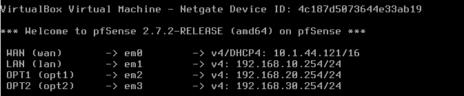
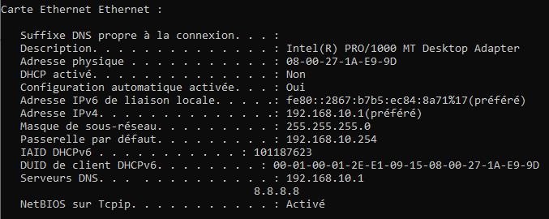
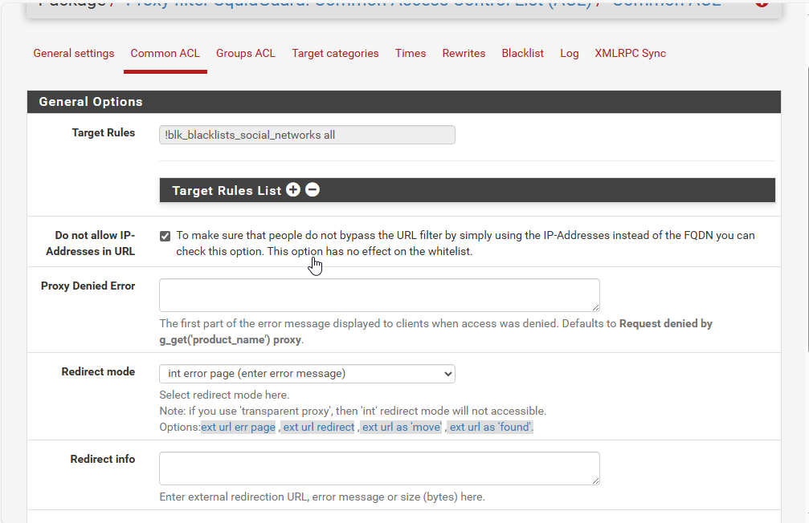

# 
 Rapport de Test

## Configuration du routeur Pfsense

Configuration dur routeur avec les OPT1 qui est mon vlan 2 et OPT2 qui est mon vlan 3 :  

## Configuration du serveur

Configuration de mon serveur DHCP et DNS :  

## Configuration du server DHCP

Configuration des pools dhcp pour mon vlan 2 et mon vlan 3 :  

## Configuration du relay DHCP

Configuration de mon DHCP relay :  

## Configuration du PC

Configuration de mon pc sur le vlan 2 :  

  

Configuration de mon pc sur le vlan 3 :  

## Configuration du serveur proxy:  

  
  
  
  
  
  
  
  
  
  
  
  
  

La preuve que mon proxy bloque les réseaux sociaux, voici ce qui se passe quand j'essaye d'accéder à des réseaux sociaux :

  
