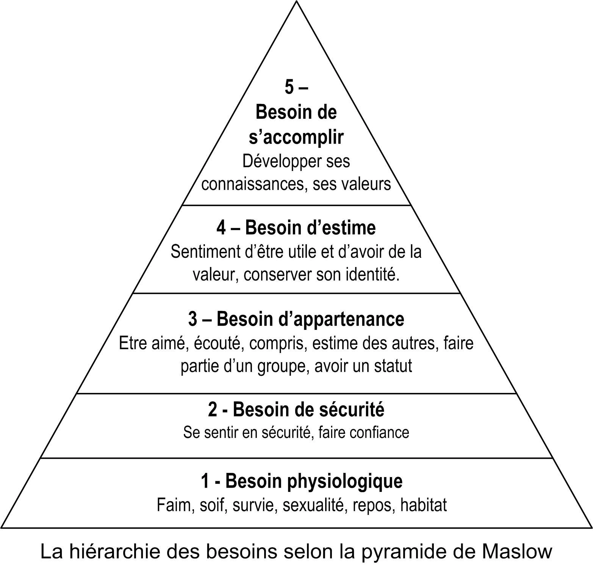

# 
 Cours CEJM

micro-économie : relation client, patron-employé.

macro-économie : relation avec l'extérieur

SWOT : Strenght, Weakness, Opportunity, Threat. -> Microéconomie

PESTEL : politique économique social technologie evironemental et légal. -> Macroéconomie

Prélèvement obligatoire : impots (somme payé à l'état en fonction de son statut), IS (impots sur la société), URSAF (Union de recouvrement des cotisations de sécurité sociale et d'allocations familiales)

Qualification juridiques : Abus de droits

Partie demanderesse, partie défenderesse.

Le RGPD : Règlement général sur la protection des données (Loi européenne)

La CNIL : Commission nationale de l'informatique et des libertés = Gendarme de l'internet.

Créancier et débiteur.

Loi de finance : La loi de finances est l'acte législatif par lequel le Parlement vote le budget de l'État. Elle autorise le pouvoir exécutif à percevoir l'impôt et à engager des dépenses publiques pendant une période déterminée, et peut contenir d'autres dispositions relatives aux finances publiques.

convention collective : accord

Schumpeter la destruction créatrice

4 styles de management :

- Autoritaire  
- Paternaliste  
- Consultatif  
- Participatif  

Finalité : objectif prioritaire et de long terme de l'entreprise (économique,social,sociétal(RSE : Responsabilité sociétal de l'entreprise))

marque d'employeur.

Contextutalisation, définition, anonce du plan

Mail de la prof : solenerigail@gmail.com

## Résulmé première année

### Thème 1

### Chap 1

- Ménages -> Consommer
- Entreprises -> Produire des biens/services non marchands
- Banque -> financer
- Administration publique (Etat, Collectivité, Téritoriale, Administration de Secu Social) -> produire des biens/services non marchands par le biai de taxation

Les échanges portent sur differents biens économiques :

- Biens productions
- Biens consomations
- Services marchands et non-marchands

Les flux éconimiques :

- Flux réels/physiques
- Flux financiers/monataires

### Chap 2

- Marché des biens et services = demande <-> prix <-> offres
- Marchés financiers = Capital <-> Interéts <-> épargne
- Marchés du travail = Demande de l'entreprise <-> salaire <-> Offre de travail

Les conséquances d'un prix trop élévé :

- décourage les demandeur
- attire les offreurs
- Le prix aura tendance à baisser jusqu'au prix d'équilibre

Les conséquances d'un prix trop bas :

- attire les demandeur
- décourage les offreurs
- Le prix aura tendance à augmenter jusqu'au prix d'équilibre

Les conditions d'une concurrence parfaite :

- La transparence
- Atomicité des marchés
- Absence de barrière à l'entrée

Les conditions d'une concurrence parfaite :

- Asymétrie d'information
- Situation de monopoles ou d'entente
- Existance de barrières

Externalité : L'activité des agents économiques peut produire des effets sur d'autres agents sans contre-partie finacière  

- Positive
- Négative

### Chap 3 et 4

Les étapes de la formation : 

- Rencontre de l'accord des volontés
    - Situation précontractuelle:  
        - Pourparlers
        - Promesses de contrat:
          - La promesse bilatérale
          - la promesse unilaterale
          - Le pacte de préférence
- Une offre et accepteur tacite ou expresse
- Une formalité nécessaire ou pas :
  - Consensuel : pas de formalité obligataire
  - Solannel : Formalité particulière

Les conditions de validité :

- Un consentement exempt de vice :
  - Erreur
  - Violence
  - Dòl
- La capacité :
  - de jouissance
  - d'exercice
- Un objet certain :
  - Licite
- La force obligatoire du contrat:
  - "Tien lieu de Loi à celui qui l'ont fait" = obligation de la respecter, le contrat est irrévocable, et exécuté de bonne foi
- Le contrat ne créé des obligations qu'entre les parties

Sanction :

- nullité
  - totale
  - partielle
- nullité
  - absolue : tout le monde peut demander la nullité
  - relative : les paties

### Chap 4

Les finalités de l'entreprise :

- économique : créer des produits et des bénéfices
- social : prendre en compte le bien être des salariés
- sociétal : impact d el'entreprise dau niveau ecologique et de la société

Les partie prenantes : acteur internes ou externes qui vont avoir une influence sur les décisions de l'entreprise -> Freeman

- Interne : Dirigeant, Actionnaire, Salarièe, Syndicats
- Externe : Syndicats, État, clients, fournisseurs, ONG et associations

les étapes de la création d'entreprise

1. l'idée
2. Business plan
3. chercher des finacements
4. obtenir des aides et des subventions
5. choisir son satut juridique
6. Démarches administrative

Schumpter : 

- logique entrepreneriale = visionnaire trouver idée d'entreprise (Mark Zuckerberg)
- logique manageriale = assurer la pérennité de l'entreprise (Sheryl Sandberg)
  
## Thème 2

3 fonctions de l'État :

- Régulation -> corriger les desesuilibres économiques en regulant l'activité
- Allocation -> corriger les dysfonctionnement pour fluidifier les marchés
- Redistribution -> corriger les inegalités selon les critères de justice sociale
