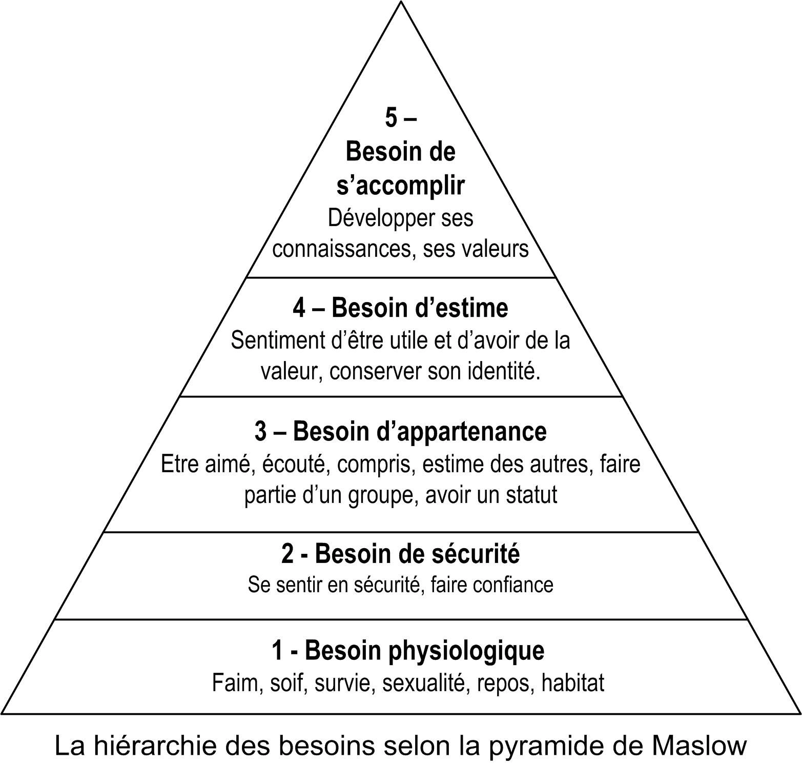

# Cours CEJM

micro-économie : relation client, patron-employé.

macro-économie : relation avec l'extérieur

SWOT : Strenght, Weakness, Opportunity, Threat. -> Microéconomie

PESTEL : politique économique social technologie evironemental et légal. -> Macroéconomie

Prélèvement obligatoire : impots (somme payé à l'état en fonction de son statut), IS (impots sur la société), URSAF (Union de recouvrement des cotisations de sécurité sociale et d'allocations familiales)

Qualification juridiques : Abus de droits

Partie demanderesse, partie défenderesse.

Le RGPD : Règlement général sur la protection des données (Loi européenne)

La CNIL : Commission nationale de l'informatique et des libertés = Gendarme de l'internet.

Créancier et débiteur.

Loi de finance : La loi de finances est l'acte législatif par lequel le Parlement vote le budget de l'État. Elle autorise le pouvoir exécutif à percevoir l'impôt et à engager des dépenses publiques pendant une période déterminée, et peut contenir d'autres dispositions relatives aux finances publiques.

convention collective : accord

Schumpeter la destruction créatrice

4 styles de management :

- Autoritaire  
- Paternaliste  
- Consultatif  
- Participatif  

Finalité : objectif prioritaire et de long terme de l'entreprise (économique,social,sociétal(RSE : Responsabilité sociétal de l'entreprise))

marque d'employeur.

Contextutalisation, définition, anonce du plan