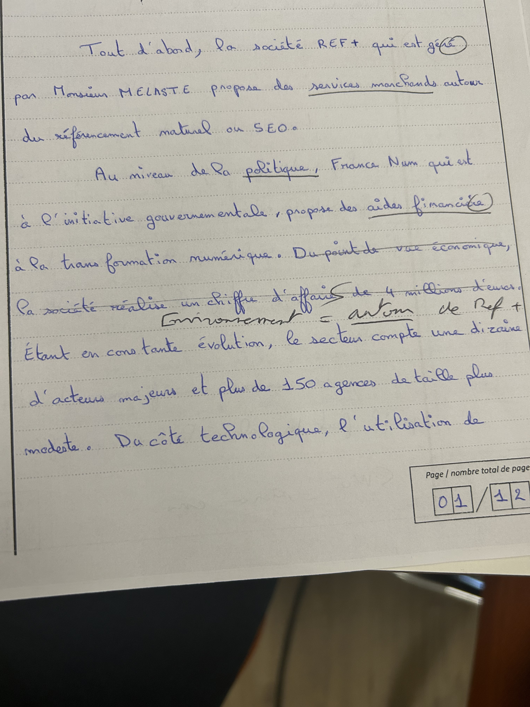
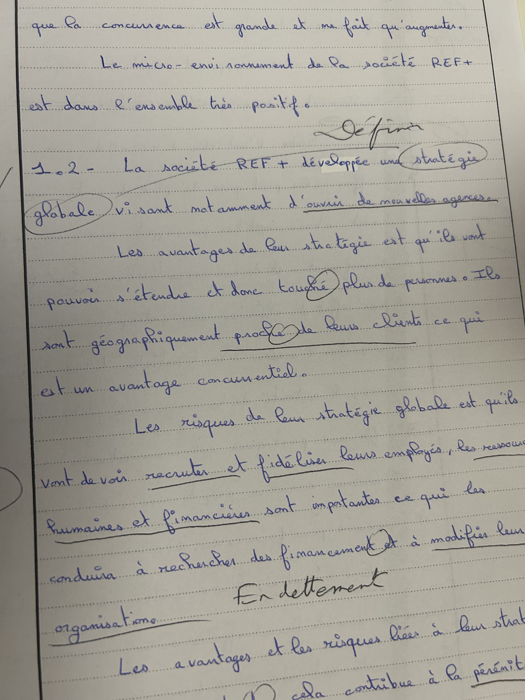

# 
  Analyse d'une copie

Mauvaise utilisation de la méthode PESTEL sur le point économie, comme vu ci-dessous :

Bonne application de la méthodologies dans les réponses 1.2 et 1.3. Elle utilise un point par paragraphe, cela permet au correcteur d'avoir une fluidité dans la lecture.

Comme ci-dessus, une définition est attendue pour le terme stratégie globale, on ne sait pas si elle comprends ou non le terme.

Dans la copie, mettre en avant les réponses.

Mauvaise utilisation des annexes, trop d'approts personnels.